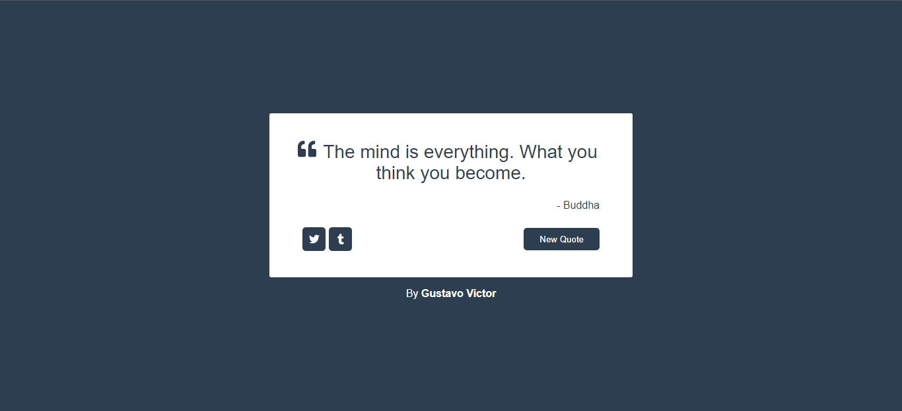

<h1 align='center'>Quote Machine</h1>

<p align="center">
  <a href="#-sobre">Sobre</a>&nbsp;&nbsp;&nbsp;|&nbsp;&nbsp;&nbsp;
  <a href="#-prints">Layout</a>&nbsp;&nbsp;&nbsp;|&nbsp;&nbsp;&nbsp;
  <a href="#-tecnologias-e-ferramentas">Tecnologias e Ferramentas</a>&nbsp;&nbsp;&nbsp;|&nbsp;&nbsp;&nbsp;
  <a href="#-funcionalidades">Funcionalidades</a>&nbsp;&nbsp;&nbsp;|&nbsp;&nbsp;&nbsp;
  <a href="#-instalação">Instalação</a>&nbsp;&nbsp;&nbsp;|&nbsp;&nbsp;&nbsp;
  <a href="#-licença">Licença</a>&nbsp;&nbsp;&nbsp;|&nbsp;&nbsp;&nbsp;
</p>

<p align="center">
    ✔ Projeto concluído
</p>

<p align="center">
    
    
    
    
</p>

<hr/>

## ❓ Sobre

Este projeto é uma aplicação React que busca e exibe alguma citação aleatória de algum autor na tela do usuário. O projeto faz parte de um [desafio da freeCodeCamp](https://www.freecodecamp.org/learn/front-end-development-libraries/) no curso de bibliotecas e frameworks front-end. 
Clique aqui para ver como o projeto ficou no [Codesandbox]() 


## 🎨 Layout

Clique na imagem para ir para um vídeo de demonstração do projeto
<p align="left">
    <a href="https://www.loom.com/share/10eb74cc324d405fb25f0beab46f4c74" target="_blank">
        
    </a>
</p>

## 🛠 Tecnologias e Ferramentas

- [HTML](https://developer.mozilla.org/pt-BR/docs/Web/HTML)
- [ReactJS](https://pt-br.reactjs.org/)
- [React Icons](https://react-icons.github.io/react-icons/)
- [Styled Components](https://styled-components.com/)
- [Vite](https://vitejs.dev/)

Veja como ficou o arquivo [package.json](./package.json) 


## ⚙ Funcionalidades 

- [x] Buscar conjunto de citações de autores usando Fetch API 
- [x] Selecionar uma citação aleatória para exibir na tela 
- [x] Mudar de citação ao atualizar a página ou ao clicar no botão
- [x] Mudar o tema de cores da página ao atualizar ou ao clicar no botão  
- [x] Compartilhar citação no Twitter e no Tumblr


## 💻 Instalação 

Para abrir e executar o projeto no seu computador, você vai precisar ter o [Node.js](https://nodejs.org/en) instalado na sua máquina (recomendo baixar a versão LTS). Além disso, para conseguir executar os comandos de terminal a seguir, você precisará instalar [GIT](https://git-scm.com/). 
É recomendado ter alguns conhecimentos básicos de HTML, CSS, JavaScript e React para conseguir entender os códigos do projeto e também ter alguma noção prévia de comandos de terminal para conseguir acompanhar as instruções no seu computador.
Após ter certeza de que tudo está instalado no seu computador, basta acompanhar os passos a seguir: 


1. Faça download do projeto ou clone ele com o seguinte comando: 

```bash 
    git clone https://github.com/Gustavo-Victor/github-finder.git
```
 
2. Descompacte o arquivo do projeto e abra a pasta do projeto; se tiver clonado basta só abrir a pasta do projeto; você pode abrir a pasta usando um comando de terminal: 

```bash 
    cd github-finder/ 
```

3. Instale as dependências necessárias do projeto (a pasta do projeto precisa estar aberta no terminal): 

```bash 
    yarn install 
```

4. Executar projeto no modo de desenvolvimento: 

```bash 
    yarn dev 
```

5. Abrir o projeto no seu navegador de preferência. Basta digitar na barra de pesquisa: http://localhost:5173/. 


<hr/>

## 📝 Licença 

O projeto está sob a Licensa MIT 

Qualquer pessoa pode usar, clonar e contribuir com este projeto. 

Clique [aqui](./LICENSE.md) para saber mais  
